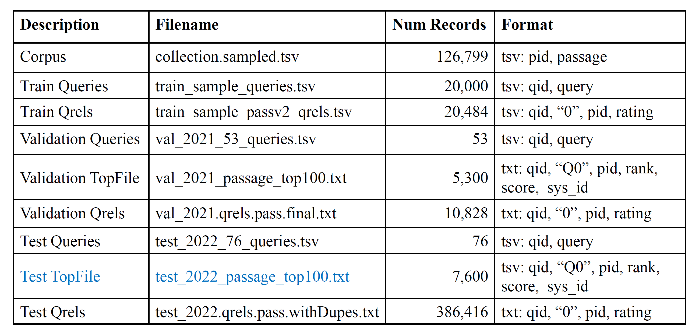

<!--
 * Copyright (c) 2023 by Huanxuan Liao, huanxuanliao@gmail.com, All Rights Reserved. 
 * @Author: Xnhyacinth, Xnhyacinth@qq.com
 * @Date: 2023-12-28 09:55:03
-->
# MIR Programs

TREC 2022 Deep Learning Passage Ranking

### sample--data

### trec_eval
calculate the evaluation metrics: NDCG@10

### Run
`python -u model.py`